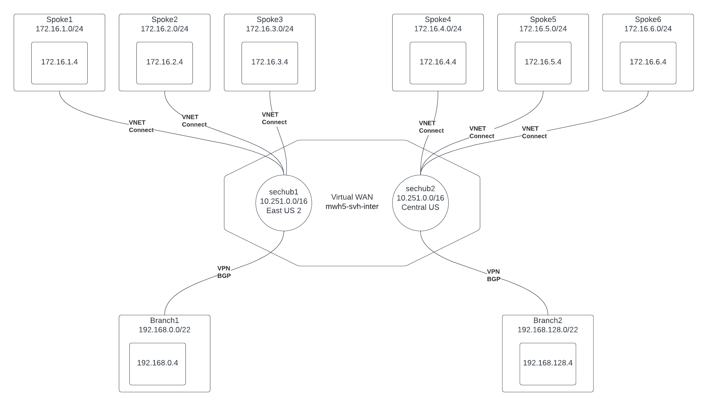

# Virtual WAN infrastructure to demo multi-region Cloud NGFW for Azure

## Resources 
- Create VWAN with two hubs
- Create three spoke VNETs per hub
- Create one branch VNET per region
- Attach each branch to local region VWAN hub via S2S IPsec Tunnel
- Create VM in each branch and spoke VNET
- On Each VM (with public IP and /32 route to deployment IP)
	- Install various network tools
	- Install public SSH key if present
	- Install trusted CA certificate
	- Install NetworkWatcher agent

## Requirements
- bash (tested with bash 3.2)
- az (tested with 2.49.0)

## Use takes about 90 minutes to deploy
1. git clone ...
2. Edit env.sh
3. ./01_create_vwan_with_spokes.sh
4. ./02_create_branches.sh
5. ./03_create_network_watcher.sh

## Next Steps
1. Choose Panorama or Portal managed CNGFW
2. Deploy Cloud NGFWs
3. ...

## Verification/Demo
1. Decryption (Logs and Issuer seen on client)
2. Routing Intent (Log entry per CNGFW for inter-region flows)
3. Dynamic Address Groups and Shared Policy with Parent Device Group for CNGFW for Panorama

## Notes
